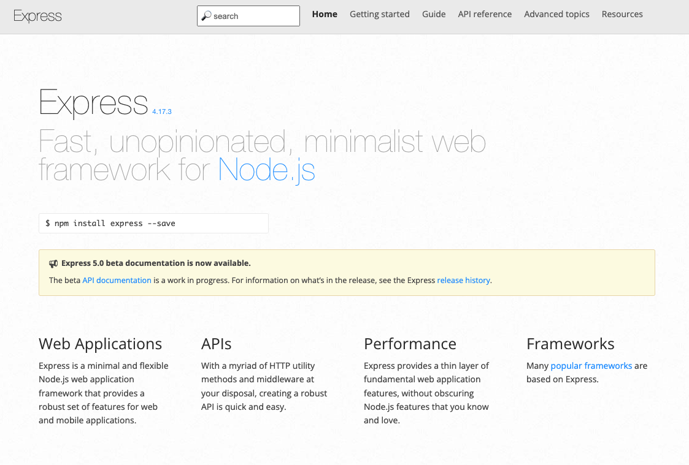
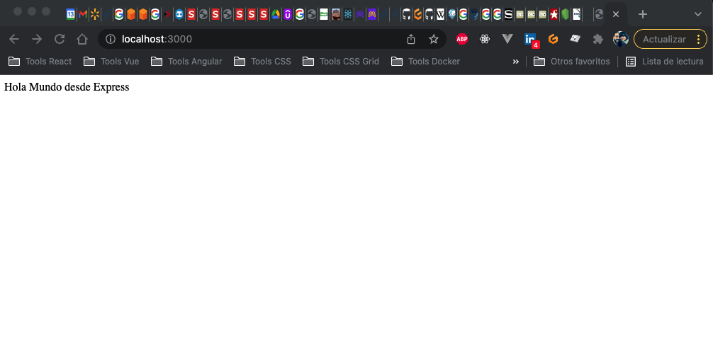

## ¿Qué es Express y para qué sirve?

Express es un framework web, escrito en JavaScript y alojado dentro del entorno de ejecución NodeJS. El modulo explica algunos de los beneficios clave de este framework, como configurar tu entorno de desarrollo y como realizar tareas comunes en desarrollo y publicación web.

## ¿Qué función cumple Express en una aplicación web?

Primeramente definamos qué es Express. Básicamente es un marco de desarrollo minimalista para Node.js que permite estructurar una aplicación de una manera ágil, nos proporciona funcionalidades como el enrutamiento, opciones para gestionar sesiones y cookies, etc. Express nos permite crear no solo *Aplicaciones Web* sino tambíen *API's*, esto quiere decir que ademas de genstionar nuestro frontend (html, css, imagenes, javascript, etc.). nos permite crear apis las cuales podran ser utilizadas con cualquier framework o libreria de frontend como por ejemplo: React, Angular, Vue, etc.


## Iniciar una aplicacion con express

Para iniciar un proyecto con express crearemos una carpeta llamada *test-express*, una vez creada nos ubicaremos en la carpeta desde un terminal o con nuestro IDE favorito abriremos un terminal en el cual ejecutaremos el siguiente comando:


```bash
$ npm init -y
```

Una vez ejecutado obtendremos un archivo basico de configuracion llamado *package.json*, una vez creado el archivo para trabajar nodejs como módulos podemos modificar nuestro ***package.json*** y agregar lo siguiente:

```json
{
    "name": "curso-nodejs-4geeks",
    "version": "1.0.0",
    "description": "",
    "type": "modules",
    "main": "index.js",
    "scripts": {
        "test": "echo \"Error: no test specified\" && exit 1"
    },
    "keywords": [],
    "author": "",
    "license": "ISC",
}
```
Por defecto nodejs trabaja con commonjs para importar los modulos dentro de nuestra aplicaciòn.


Procederemos a instalar express usando el siguiente comando:

```bash
$ npm i express --save
```

Ya instalado express en nuestras dependencias, procederemos a crear una archivo llamado ***app.js***, en el cual escribiremos las siguientes lineas de codigo:

1. Importamos express en nuestro archivo:


```javascript
const express = require('express'); // importando express
```
        
2. Instanciamos express

```javascript
const app = express() // creando una instancia de express
```

3. Definimos el puerto por el cual se estara ejecutando nuestra aplicacion:

```javascript
const port = 3000; // definimos nuestro puerto a utilizar
```

4. Definimos una ruta utiliando el metodo GET el cual recibe dos parametros, un string que sera la forma de acceder a nuestro ruta y el segundo es una funcion que sera ejecutada al momento de acceder a la ruta, la cual recibe nos proporciona dos objetos un request y un response, siendo el primero el que nos permitira obtener la informacion que nos envia el cliente y el response el cual nos permitira entrear un mensaje al cliente que esta accediendo a nuestra ruta

```javascript
app.get('/', (request, response) => {
     response.send('Hola Mundo desde Express');
})
```

5. Definimos nuestro servidor utilizando el metodo *listen* el cual podremos acceder desde nuestra instancia de express, el cual recibe dos argumentos, el primero es el puerto por el cual queremos estar atentos si el cliente se conecta a nuestra aplicacion y el segundo es una funcion la cual podremos observar al momento de acceder a nuestra aplicacion

```javascript
app.listen(port, () => {
     console.log("Iniciando el servidor sobre el puerto" + port);
});
```

7. El resultado esperado es el siguiente para verlo debes acceder a la siguiente ruta desde un navegador http://localhost:3000/:

    

6. Para informa de cuál es la carpeta de plantillas y cuál es la extensión que tienen estos archivos de plantilla vamos a añadir las siguientes lineas.

```javascript
...
const path = require('path');        
...
// view engine setup
app.set('views', path.join(__dirname, 'views'));
app.set('view engine', 'pug');
...
```

7. Para definir donde se cargaran nuestros archivos publicos como por ejemplos css, js, imagenes, o archivos descargables podemos definir la siguiente linea: 

```javascript
...
app.use(express.static(path.join(__dirname, 'public')));
...
```

8. Una vez configurado el archivo desde un terminal o consola procederemos a ejecutar el siguiente comando.

```bash
$ node app.js
```
